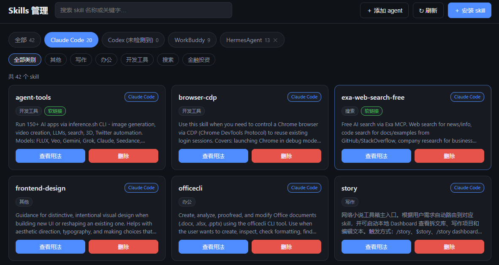

# Skills 管理工具

本地 skills 自动管理工具：扫描各 agent（Claude Code / Codex / WorkBuddy 及自定义 agent）已安装的 skill，按 agent 与主题自动分类，支持查看用法、删除、安装。

基于 Node.js + Express，前端为原生 HTML/CSS/JS，无构建步骤，开箱即用。



## 功能

- **扫描分类**：自动探测各 agent 的 skills 目录，解析每个 skill 的 `SKILL.md`（name / description），按 agent 分组、按关键词自动归类（写作 / 金融投资 / 搜索 / 办公 / 开发工具 / 其他）。
- **查看用法**：点击卡片渲染完整 `SKILL.md` 正文。
- **删除**：删除目录或软链接，可选连带删除共享库真实目录，并同步更新 `~/.agents/.skill-lock.json`。
- **安装**：支持两种方式 ——
  1. **Git 仓库地址**：`https://…`、`git@…` 或 `owner/repo`，先扫描仓库里的 skill，再选择安装到哪些 agent（可多选，支持「全选」，默认 Claude Code）。
  2. **自定义命令**：直接执行 shell 命令（最长 120s），完成后重新扫描；对 `npx skills add …` 自动补 `--yes` 转为非交互。
- **自定义 agent**：在界面里添加任意 agent 目录（持久化到 `custom-agents.json`），与内置 agent 一视同仁。

## 快速开始

需要 Node.js（≥ 18，支持 ES Module 与 `node:fs` 等内置模块）。

```bash
npm install
npm start
```

浏览器打开 <http://localhost:3456>。

也可以直接用启动脚本（首次运行会自动安装依赖）：

- Windows：双击 `start.bat`
- macOS / Linux：`./start.sh`

## 目录结构

```
skills-manage/
├── server.js            # Express 入口 + REST API
├── config.json          # agent 目录、端口、分类关键词（可改）
├── custom-agents.json   # 界面添加的自定义 agent（可改，已 gitignore）
├── skills-lock.json     # 项目内安装来源记录（示例）
├── package.json
├── start.bat / start.sh # 启动脚本
├── src/
│   ├── scanner.js       # 探测 agent + 扫描 skill
│   ├── frontmatter.js   # 解析 SKILL.md frontmatter
│   ├── categorize.js    # 关键词 → 分类
│   ├── install.js       # git / command 安装
│   ├── remove.js        # 删除（含软链接安全处理）
│   ├── lockfile.js      # 读写 ~/.agents/.skill-lock.json
│   └── agents-store.js  # 读写 custom-agents.json
└── public/              # 前端页面（原生 HTML/CSS/JS）
```

## 配置

编辑 `config.json`：

- `port`：服务端口（默认 3456，也可用环境变量 `PORT` 覆盖）。
- `agents`：各 agent 的 skills 目录，`~/` 表示用户主目录、`<cwd>` 表示当前工作目录。
- `categories`：分类关键词表，按名称/描述子串匹配，可自行增删。

安装来源记录写入 `~/.agents/.skill-lock.json`（跨项目共享）。

## 说明

- 删除不可逆，删除前请确认；软链接删除只移除链接本身，勾选「同时删除共享库中的真实目录」才会移除目标。
- 自定义命令由使用者自行保证正确性，工具不额外校验；交互式界面（无 TTY）无法在网页中驱动，遇到时会提示改用 `--yes` 或「Git 仓库地址」方式安装。

## License

[MIT](./LICENSE)
